<!-- _class: pink lead -->

# 2025年　夏季インターンシップ
## GitHub Actions ハンズオン

テクノロジーオフィス　リンウェイトン

---

## 目次

- 進み方説明
- GitHub Actions 入門
- GitHub Actions の初期設定
- Composite Actions の運用 <span class="label2">SKIP</span>
- sacloud_apprun_actions を使った AppRun へのデプロイ

---

<!-- _class: pink lead -->

# 進み方説明

---

## 進み方説明

- まずは、下記のハンズオン用のリポジトリをフォークしよう
````bash
https://github.com/ippanpeople/actions-handson
````
- このパートは、フォークしたリポジトリの`marp/slides/slide.pdf`で説明
- 具体的な手順は下記のREADMEに記載されているので、それぞれのREADMEを参照しながら進めていこう
  - `00_introduction_Github_Actions/README.md`
  - `01_fork_and_setup/README.md`
  - `02_composite_actions/README.md` <span class="label2">SKIP</span>
  - `03_sacloud_apprun_actions/README.md`
- **目的**: GitHub Actions の基礎を理解し、Actions を使ったアプリケーションのデプロイフローを体験すること
---

<!-- _class: pink lead -->

# GitHub Actions 入門
## 00_introduction_Github_Actions

---

## GitHub Actions とは？

バージョン管理システムであるGitHub上に提供する、ワークフローを自動化するCI/CDツール
- **できごと**
  - イベント駆動型で、変更されたコードに応じて自動的に特定の処理・ビルド・テスト・デプロイを実行
- **動作するところ**
  - ワークフローの定義に基づき、GitHub上やセルフホストされたランナーで動作
- **ユーザビリティ**
  - GitHubのUI上で簡単に設定・管理が可能、CLIやAPIからも操作可能

---

## GitHub Actions の基本コンポーネント

- **Actions**
  - 自動化ツールのこと。actions が小文字の際にワークフロー内で特定のタスクを実行する再利用可能なコード単位（プラグインのようなもの）
- **Workflow**
  - `.github/workflows/*.yml` で定義される自動化プロセス
- **Trigger**
  - ワークフローを開始するイベント（例: `push`、`pull_request`、手動実行など）
- **Jobs**
  - 同じランナー環境（仮想マシンなど）で実行されるステップの集合。並列または順次実行が可能

---

## GitHub Actions の基本コンポーネント

- **Steps**
  - ジョブ内の個々のタスク。コマンド実行やアクションの呼び出しができる


---

## GitHub Actions の利用方法

1. Workflow ファイルを作成
2. Workflow を有効化
3. シークレットと変数の設定
4. Workflow を実行

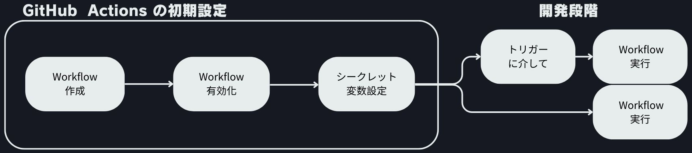

---

<!-- _class: pink lead -->

# GitHub Actions の初期設定
## 01_fork_and_setup

---

## You Need a Workflow

Github Actions を利用するため、自動化プロセスであるワークフローを定義する必要がある
- 内容：基本的に先程紹介した基本コンポーネントを組み合わせて作成
- タスクの実行方法：
  - **run**: シェルコマンドを実行する　<- 01_fork_and_setup.yml
  - **uses**: 他のアクションを呼び出す <- 03_sacloud_apprun_actions.yml

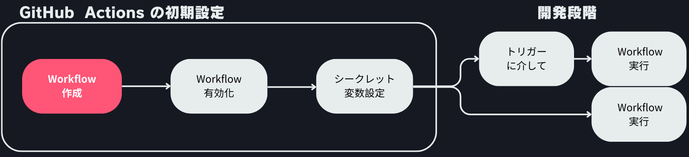

---

## You Need a Workflow

`01_fork_and_setup.yml`を例として、見てみよう:
- 用途：ハンズオンの進捗を確認するため、各ハンズオンが終わったたびに、Slack に通知し、進捗を報告用スレッドから確認できるように
- トリガー：手動実行
- 実行すること
  - json payloadを作成
  - curl で payload を Slack Webhook に送信
  - エラーハンドリング

---

## Workflow の有効化

フォーク直後や新規リポジトリでは、GitHub Actions ワークフローが無効化されている場合があるので、必要に応じて有効化する必要があります。

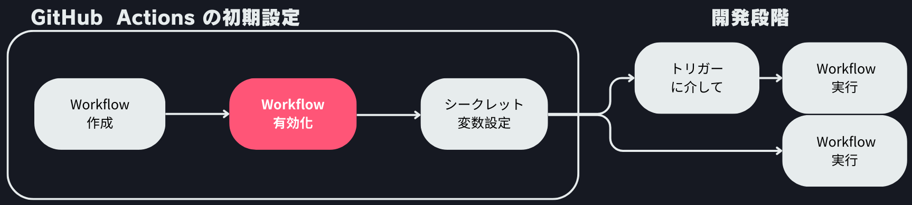

---

## Workflow の有効化 <span class="label2">SKIP</span>

1. **ワークフローの初期状態を確認**
   - 有効化されてない状態


---

## Workflow の有効化 <span class="label2">SKIP</span>

2. **ワークフローを有効化する必須要件**
    - リポジトリの設定で Actions のパーミッションが適切に設定
    - `.github/workflows` ディレクトリ内にワークフロー定義ファイルが存在


---

## Workflow の有効化 <span class="label2">SKIP</span>

3. **ワークフローを有効化しよう**
    - `Settings > Actions > General` に移動し Actions permissions を`Allow all actions and reusable workflows` に設定
    - 既存の `.github/workflows-disable` を正しくリネームして `.github/workflows` にする

<div class="side-by-side">
  
  
</div>

---

## Workflow の有効化

4. **有効化後の状態を確認**
   - 有効化が完了すると、ワークフローが実行可能な状態になる


---

## シークレットと変数の設定

GitHub Actions では、外部サービスへの**認証情報や個人情報**などを安全に管理するために `シークレット（Secrets）` と `変数（Variables）` を利用します。シークレットは主にパスワードや API キーなどの機密情報を、変数はワークフロー内で再利用したい値を格納します。これらはリポジトリの `Settings > Secrets and variables` から設定できます。
これから今回のハンズオンに使用するシークレットと変数を設定していきます。

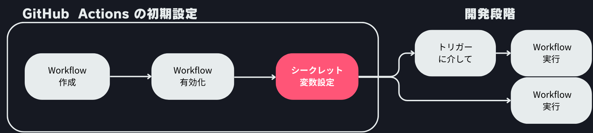

---
## シークレットと変数の設定　<span class="label">ハンズオン</span>

1. **シークレットの設定**

| Name              | Value                        |
|-------------------|-----------------------------|
| SLACK_WEBHOOK_URL | Slack の Incoming Webhook URL |

<div class="side-by-side">
  
  
</div>

---

## シークレットと変数の設定 <span class="label">ハンズオン</span>

2. **変数の設定**

| Name         | Value                        |
|--------------|-----------------------------|
| AUTHOR_NAME  | 自分の名前                   |
| REPOSITORY   | 自分の GitHub リポジトリリンク |
| MESSAGE     | メッセージ内容（例: "Hello, World!"） |

<div class="side-by-side">
  
  
</div>

---

## シークレットと変数の設定
3. **設定後の確認**: 設定が正しく反映されているか確認
<div class="side-by-side">
  
  
</div>

---

## ワークフローの実行 <span class="label">ハンズオン</span>

1. **ワークフローの選択**: リポジトリの `Actions` タブに移動し、`01 Fork And Setup`の`ワークフロー`を選択
2. **ワークフローの実行**: `Run workflow`ボタンをクリック
3. **実行の確認**: ワークフローが正常に実行されると、Slack チャンネルにメッセージが送信される。これにより、GitHub Actions のセットアップが正しく行われたことを確認できる

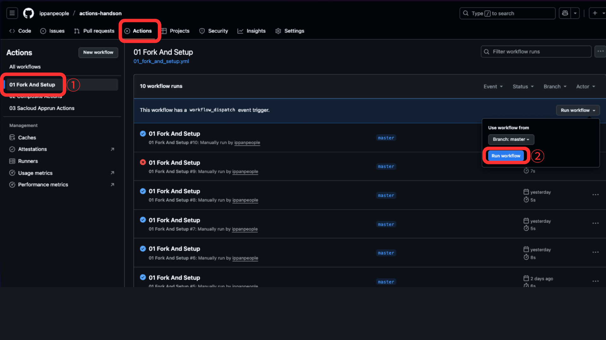

---

<!-- _class: pink lead -->
# Composite Actions の運用 <span class="label2">SKIP</span>
## 02_composite_actions
---

## Composite Actions とは？ <span class="label2">SKIP</span>
`01_fork_and_setup` では、`run`でコマンドを実行したが、より複雑な処理を定義したい場合、ワークフローはスパゲッティ化してしまうことがあります。
Composite Actions は、複数のシェルステップを組み合わせて作成されるカスタムアクションです。YAML で記述され、GitHub Actions のワークフロー内で再利用可能なロジックを提供します。これにより、**複雑な処理を簡潔にまとめ、再利用性を高めることができます**。

---

## 前のステップとの比較 <span class="label2">SKIP</span>

`uses` で公開されている Composite Actions を呼び出し、with でパラメータを指定することで、複雑な処理を簡潔にまとめることができる


---

## 実行してみよう 　<span class="label2">SKIP</span>

`02_composite_actions.yml` は `01_fork_and_setup.yml` の内容を Composite Actions を使って書き直したものだけなので、各自実行して、動作を確認してください。
1. **ワークフローの選択**: リポジトリの `Actions` タブに移動し、`Composite Actions`の`ワークフロー`を選択
2. **ワークフローの実行**: `Run workflow`ボタンをクリック
3. **実行の確認**: ワークフローが正常に実行されると、Slack チャンネルにメッセージが送信される。これにより、GitHub Actions のセットアップが正しく行われたことを確認できる

---

<!-- _class: pink lead -->

# sacloud_apprun_actions を使った AppRun へのデプロイ
## 03_sacloud_apprun_actions

---

## sacloud_apprun_actions とは？

`sacloud_apprun_actions` は、Go アプリケーションをさくらの AppRun にデプロイするときのフローを自動化するための Composite Actionsです。デプロイする以外、**データ永続化のため、登録されたオブジェクトストレージのバケットに　SQLite　レプリカの作成**機能も含まれており、アプリケーション再デプロイ後も**データの永続化**ができます。

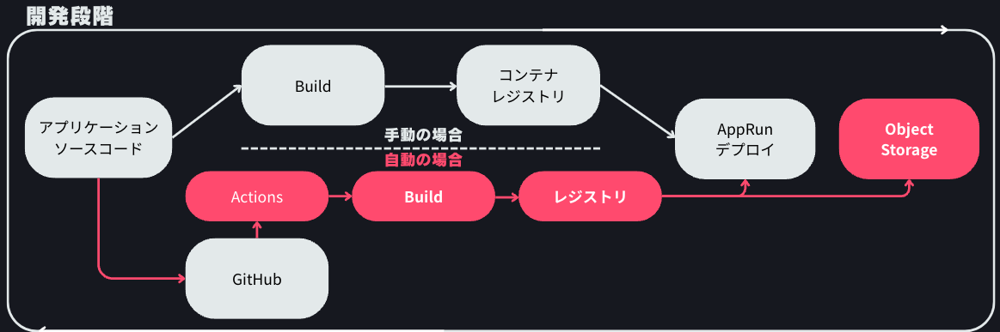

---

## sacloud_apprun_actions の使い方

1. **ソースコードの準備**: `sacloud_apprun_actions` は Go アプリケーションに対して、ソースコードをビルド用の Dockerfile を提供しているので、リポジトリに Dockerfile を配置しなくても、ソースコードを用意することで利用可能

---

## sacloud_apprun_actions の使い方

2. **ワークフロー例**: `sacloud_apprun_actions` を使用する時下記のようなタスクを作成し、パラメーターを設定することで利用可能

---

## sacloud_apprun_actions の使い方

````yaml
      - name: Goアプリをデプロイ
        uses: ippanpeople/sacloud-apprun-action@v0.0.4
        with:
          use-repository-dockerfile: false
          app-dir: ./03_sacloud_apprun_actions
          sakura-api-key: ${{ secrets.SAKURA_API_KEY }}
          sakura-api-secret: ${{ secrets.SAKURA_API_SECRET }}
          container-registry: ${{ secrets.REGISTRY }}
          container-registry-user: ${{ secrets.REGISTRY_USER }}
          container-registry-password: ${{ secrets.REGISTRY_PASSWORD }}
          port: '8080'
          # SQLite + Litestream を使う場合は以下も指定
          object-storage-bucket: ${{ secrets.STORAGE_BUCKET_NAME }}
          object-storage-access-key: ${{ secrets.STORAGE_ACCESS_KEY }}
          object-storage-secret-key: ${{ secrets.STORAGE_SECRET_KEY }}
          sqlite-db-path: ./data/app.db
          litestream-replicate-interval: 10s
````

---

## sacloud_apprun_actions の使い方 <span class="label">ハンズオン</span>

3. **Secrets の設定**: リポジトリの設定で必要な GitHub Actions シークレットを登録しよう

| Name                | Value                        |
|---------------------|-----------------------------|
| REGISTRY            | コンテナレジストリの URL         |
| REGISTRY_USER       | コンテナレジストリのユーザー名     |
| REGISTRY_PASSWORD   | コンテナレジストリのパスワード     |
| SAKURA_API_KEY      | さくらの API キー                |
| SAKURA_API_SECRET   | さくらの API シークレット         |
| STORAGE_BUCKET_NAME | オブジェクトストレージのバケット名 |
| STORAGE_ACCESS_KEY  | オブジェクトストレージのアクセスキー |
| STORAGE_SECRET_KEY  | オブジェクトストレージのシークレットキー |

---

## sacloud_apprun_actions の使い方　　<span class="label">ハンズオン</span>

3. **ワークフローの実行**: ワークフローを手動で実行してみよう
  a. **ワークフローの選択**: リポジトリの `Actions` タブに移動し、`03 Sacloud Apprun Actions`の`ワークフロー`を選択
  b. **ワークフローの実行**: `Run workflow`ボタンをクリック
  c. **実行の確認**: ワークフローが正常に実行されると、Slack チャンネルにメッセージが送信される。これにより、GitHub Actions のセットアップが正しく行われたことを確認できる


---

## データ永続化の実践方法

AppRun は`ステートレス`なため、デプロイのたびにアプリケーションが再起動されます。sacloud_apprun_actions はデータ永続化の課題を解決するため、`SQLite と Litestream` を利用し、アプリ再起動後もデータが保持されるようにします。
````bash
+----------------+      
|   Container    |       
|  +----------+  |      
|  | Web  App |  |      
|  +----------+  |      
|                |      
|  +----------+  |    
|  |  SQLite  |  |       
|  +----------+  |        +---------------------+
|                |        |   Object Storage    |
|  +----------+  | Backup |  +--------------+   |
|  |Litestream|  | <----> |  |    Bucket    |   |
|  +----------+  |  Sync  |  +--------------+   |
+----------------+        +---------------------+
````
---

## データ永続化の実践方法

**⚠️ 注意:**
SQLite + Litestream を利用する際は、システム設計の妥当性に注意してください。SQLite は小規模用途に適していますが、高負荷や大量データではパフォーマンス上の制約があります。特に、**TPS (Transactions Per Second)** や、**QPS (Queries Per Second)** などの観点で制約が発生しやすいです。なので、データの安全性・一貫性 (**Consistency**) に注意が必要です。システム要件に応じて、適切なデータベースやストレージ方式の選定を検討してください。

---

## 実際の開発フローから Actions のメリットを体験

改めて強調するが、AppRun のステートレスの特性で、０スケールや、バージョンアップに応じて再デプロイする際に、データが失われてしまうことがあります。もちろん外部のデータベースを使っても解決できる問題ですが、気軽に開発していく人に対して、かなり不便なところです。
なので、これから実際の開発フローに介して、`sacloud_apprun_actions` を使ったときのメリットを体験してみましょう。

````
補足：なぜオブジェクトストレージを使うのか？基本的にマネジドなDBより、安価で AppRun のユースケースに親和性が高いためです。
````

---

## 実際の開発フローから Actions のメリットを体験

1. **データの登録**: `sacloud_apprun_actions` でデプロイされた各自のアプリにアクセスし、メッセージを投稿

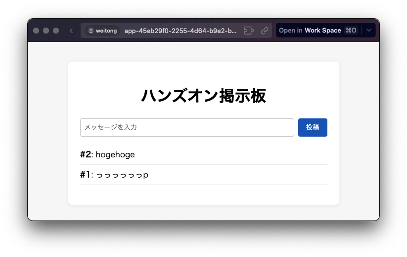

---

## 実際の開発フローから Actions のメリットを体験

2. **ソースコードの修正**: `03_sacloud_apprun_actions` のソースコードを修正

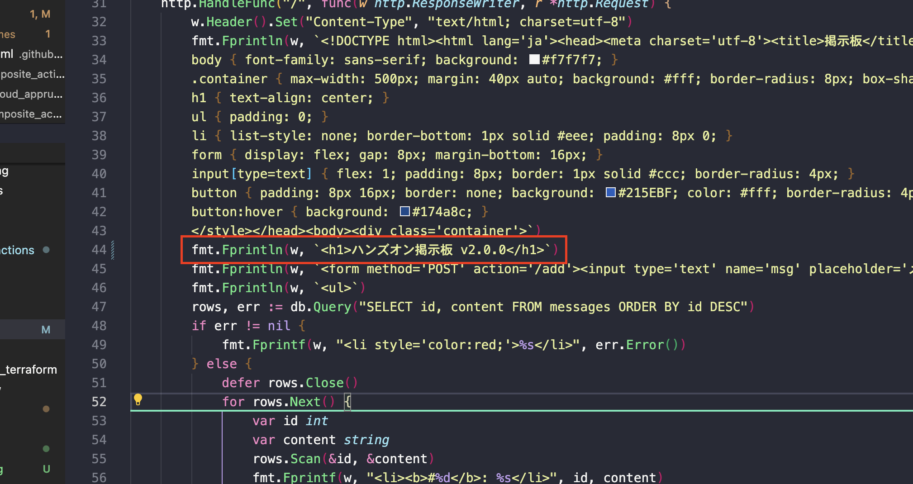

---

## 実際の開発フローから Actions のメリットを体験

3. **トリガーの変更**: `03_sacloud_apprun_actions.yml` のトリガーを `push` に変更

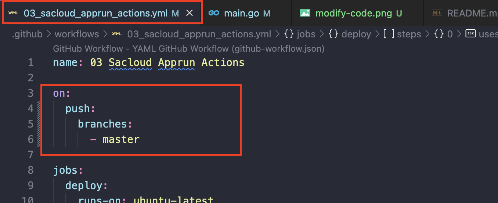

---

## 実際の開発フローから Actions のメリットを体験

4. **アプリケーションのバージョンアップ**: 修正をプッシュしたら、GitHub Actions が自動的に実行し、新バージョンを AppRun に再デプロイ

---

## 実際の開発フローから Actions のメリットを体験

5. **動作確認 1**
  - **AppRunのバージョン情報確認**: AppRun のバージョン情報を確認し、最新のバージョンがデプロイされていることを確認

<div class="side-by-side">
  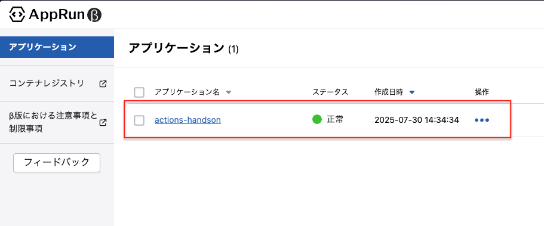
  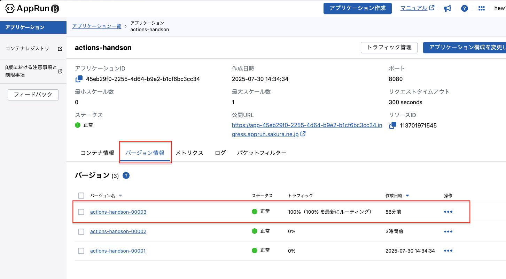
</div>

---

## 実際の開発フローから Actions のメリットを体験

5. **動作確認 2**
  - **データの確認**: アプリケーションに再度アクセスし、先ほど登録したデータが残っていることを確認

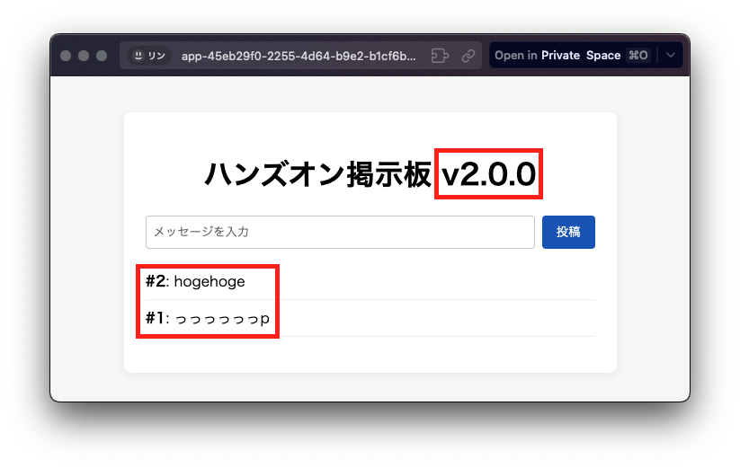

---

<!-- _class: pink lead -->

# 以上で GitHub Actions 説明は終了です
## Actions を使った開発も体験してもらったので、ぜひインターンで活用
#### 質問等ある際にお気軽に聞いてください

